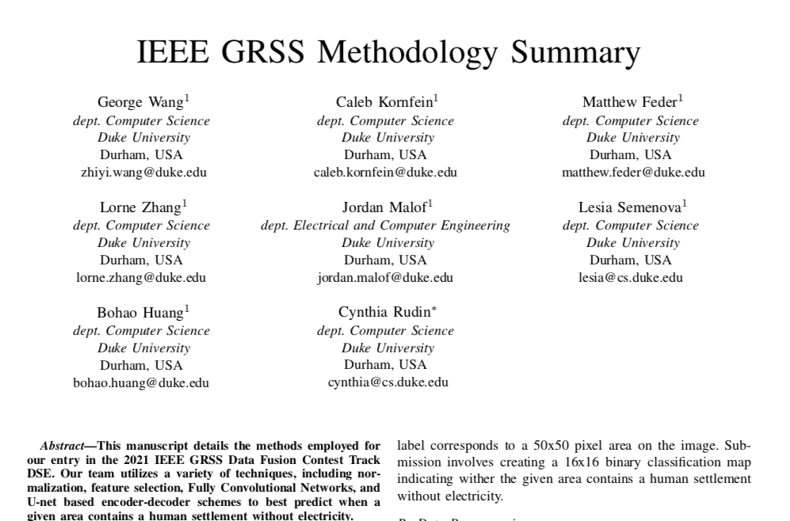
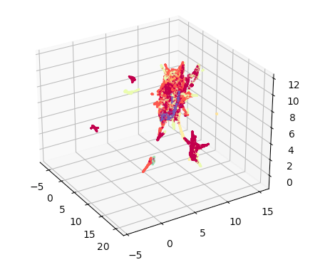
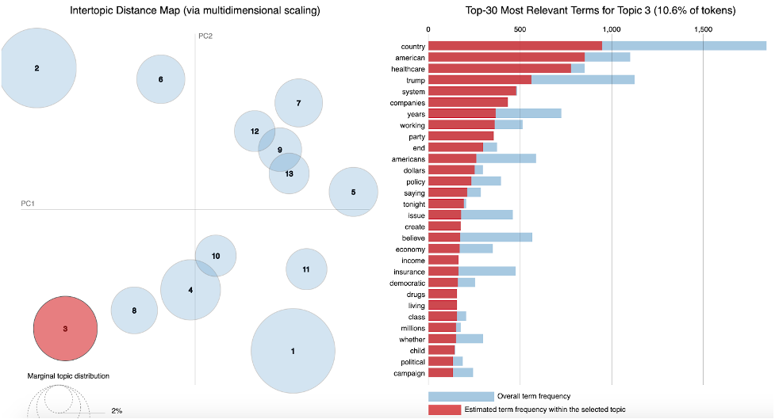

# Caleb Kornfein

Hey there! I am a rising senior at Duke studying math and computer science. I am open to full-time data science roles for after my graduation. I am especially   passionate about the math behind machine learning algorithms and ethical AI. Aside from crunching numbers and programming, I am a huge basketball fan and love learning languages.

If you are interested in talking or have any questions, feel free to reach out to me through my:

*  Email: caleb.kornfein@duke.edu
*  LinkedIn: [Caleb Kornfein](https://www.linkedin.com/in/caleb-kornfein-36460613a/)
*  Cell: 707-329-5415

## Project 1: [2021 IEEE GRSS Data Science Competition](https://www.grss-ieee.org/community/technical-committees/2021-ieee-grss-data-fusion-contest-track-dse/)  

**The Task:** Develop models that take advantage of various channels of satellite data to spot remote areas around the globe where humans live without electricity

**My Work:** I built and trained various FCN (Fully-Convolutional Network) architectures using Pytorch on a Duke compute cluster to classify 50m x 50m tiles as containing a human settlement without electricity or not. I also acted as the project leader for our team of four Duke undergraduates

**The result:** Together, we placed top 25 in the international challenge, in which we competed against research labs and PhD student teams from around the globe

**What I Learned:** Pytorch, the mathematics underpinning CNNs and neural networks, bash scripting

**Favorite Memory:** A flurry of zoom calls on the night of our submissions -- we were simultaneously nervous for the results, proud of what we had accomplished, and connected as a team

## Project 2: Flukehub

<iframe width="560" height="315" src="https://www.youtube.com/embed/YtoEv-HFCBA" title="YouTube video player" frameborder="0" allow="accelerometer; autoplay; clipboard-write; encrypted-media; gyroscope; picture-in-picture" allowfullscreen></iframe>

**The Project:** Three other Duke undergraduates and myself built an alternative version of the Dukehub system -- used by all Duke students for course enrollment and important academic information. I created the designs database schematics, handled filters and querying for courses using Django and PostgreSQL, and added frontend elements such as the heading bar.

**What I Learned:** Database schema design, Django, SQL, PostgreSQL

## Project 3: Ecosystem Acoustics

**The Project:** My home in Sonoma county, California, has been ravaged by wildfires in recent years. Working with Sonoma State Professor Matthew Clark as part of the [Soundscapes to Landscapes](https://soundscapes2landscapes.org/) project, I visualized spectrogram data. Spectrograms are visual representations of frequency patterns over time, in this case audio signals from the hundreds of recorders Professor Clark had placed around Sonoma County. The spectrograms were embedded into a higher dimensional space using a pretrained CNN, which I then visualized in 3D using UMAP in order to see how the fires had affected the sound ecosystems of Sonoma county.

**What I learned:** Dimension reduction techniques such as UMAP, Seaborn, CNN architectures, more about my home county

## Project 4: Democratic Debates Topic Analysis

**The Project:** As part of a Bayesian Statistics final project, my partner Meredith and I analyzed the transcripts of the 2020 Democratic Debates by using Latent Dirichlet Analysis to identify the topics discussed.

**What I learned:** Latent Dirichlet Analysis, NLP techniques such as tokenization and stemming

**Interesting Takeaways:** Of the 13 topics identified, only topic 7 discussed US foreign policy. The major democratic candidates -- Elizabeth Warren, Joe Biden, and Bernie Sanders -- all spent around 1-2% of their time discussing this topic. This speaks to the American-centric nature of the discourse occuring at the Presidential debates. Tulsi Gabbard, Jay Inslee, and Beto O'Rourkey in contrast spent the most time on the issue, with Beto leading the pack at 28% of his time.

